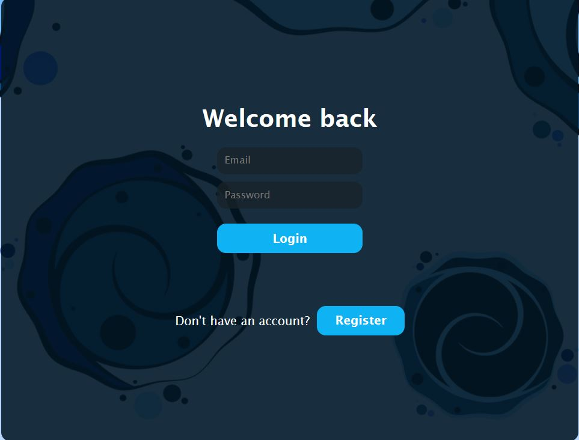
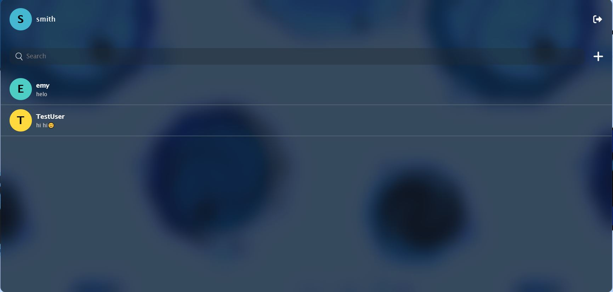
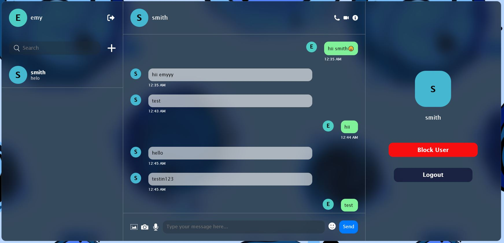
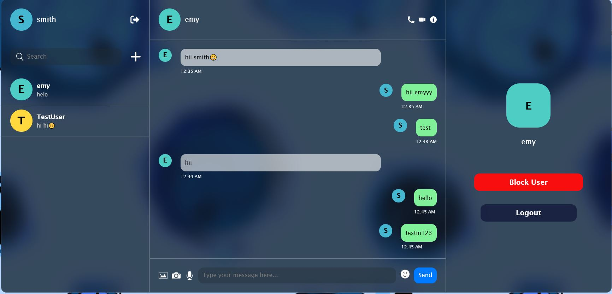

# Firebase Chat App

A real-time chat application built with React, Firebase, and Redux.

## Screenshots

### Login Page


### Chat List


### Chat View



## Features

- 🔐 User Authentication (Login/Register)
- 💬 Real-time Messaging
- 👤 User Profile with Avatar
- 🔍 Search Users
- ➕ Add New Contacts
- 🚫 Block/Unblock Users
- 😀 Emoji Picker
- 🔔 Unread Message Indicators

## Tech Stack

- **Frontend:** React 19, Redux Toolkit
- **Backend:** Firebase (Authentication, Firestore)
- **Build Tool:** Vite
- **Styling:** CSS
- **Icons:** Font Awesome

## Getting Started

### Prerequisites

- Node.js (v20.19.0 or higher)
- npm
- Firebase Account

### Installation

1. Clone the repository
```bash
git clone https://github.com/your-username/Firebase-Chat-App.git
cd Firebase-Chat-App/chat-app
```

2. Install dependencies
```bash
npm install
```

3. Create a Firebase project and add your config to `src/config/firebase.js`

4. Set up Firestore rules (see Firebase Console)

5. Run the development server
```bash
npm run dev
```
